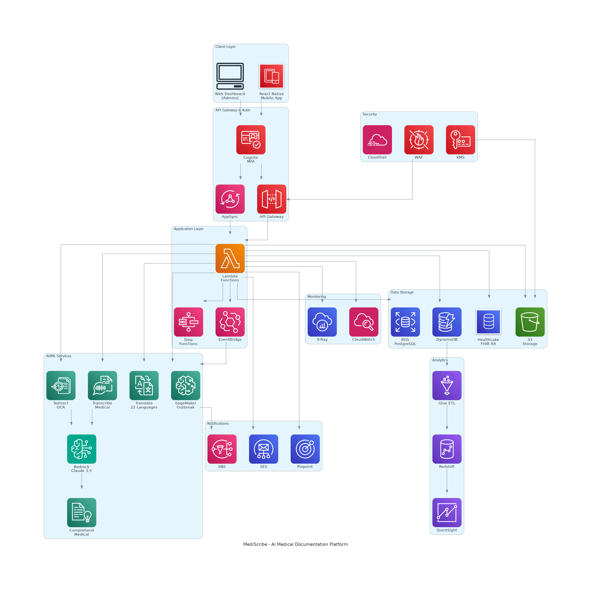

# MediScribe - AI Co-Pilot for Medical Documentation

> Transforming medical documentation from a 3-hour daily burden into a 5-minute task while preventing errors and detecting outbreaks in real-time.

## The Problem

Doctors worldwide spend **25-33% of their workday** (3-4 hours) on manual documentation instead of patient care. This leads to:
- Physician burnout (affecting 50%+ of doctors)
- Medication errors (5-7% error rate)
- Delayed outbreak detection (3-5 days)
- $200+ billion annually in wasted physician time

## The Solution

MediScribe is an AI-powered medical documentation assistant that combines **4 intelligent layers**:

### 1. Input Intelligence
- **Photo OCR**: Photograph handwritten notes → Auto-populate EHR (<10 seconds)
- **Voice-to-Chart**: Speak while examining → Structured clinical notes (<2 seconds latency)
- **Multi-Language**: Support for 22 Indian languages with cultural medical terminology

### 2. Medical Intelligence
- **Medication Validation**: Real-time dosage checking, drug interactions, allergy alerts
- **Diagnosis Assistance**: AI-suggested differential diagnoses with confidence scoring (>80% accuracy)

### 3. Pattern Intelligence
- **Outbreak Detection**: Real-time disease surveillance across hospitals (<6 hours detection)
- **Hospital Analytics**: Bed occupancy, patient flow, quality metrics dashboards

### 4. Automation Intelligence
- **Discharge Summaries**: 45 minutes → 30 seconds (99% time reduction)
- **Referral Letters**: 20 minutes → 1 minute (95% time reduction)

## Architecture

**Tech Stack:**
- **AI/ML**: Amazon Bedrock (Claude 3.5 Sonnet), Textract, Transcribe Medical, Comprehend Medical, SageMaker
- **Data**: AWS HealthLake (FHIR R4), DynamoDB, RDS PostgreSQL, S3
- **Compute**: AWS Lambda, Step Functions, EventBridge
- **Analytics**: QuickSight, Redshift, Glue
- **Frontend**: React Native (mobile), React (web)

## Impact

### Efficiency Metrics
- Documentation time: **3 hours/day → 5-10 minutes/day** (95%+ reduction)
- Discharge summary: **45 minutes → 30 seconds** (99% reduction)
- **ROI: 300x+** (hospitals save $185K/year, pay $600/year)

### Quality Metrics
- Medication error rate: **5-7% → <1%**
- Diagnostic accuracy: **80%+** for top 3 AI suggestions
- Documentation completeness: **70% → 95%+**

### Population Health
- Outbreak detection: **3-5 days → <6 hours**
- Forecast accuracy: **75%+** within 25% margin

## Personal Story

This project was inspired by my sister, a medical intern who works 9-hour shifts seeing patients, then spends an additional 3 hours every night manually entering patient information. This 12-hour workday leads to burnout and errors. MediScribe aims to eliminate this burden for **10 million doctors worldwide**.

## Market Opportunity

- **Target Market**: $30+ billion medical documentation market
- **Pricing**: $50/doctor/month (Individual), $50/doctor/month (Hospital), Custom (Enterprise)
- **Geographic Focus**: India first (1.3M doctors), then global expansion
- **Revenue Projections**: 
  - Year 1: $960K ARR (2,000 doctors)
  - Year 2: $10.8M ARR (20,000 doctors)
  - Year 3: $39M ARR (65,000 doctors globally)

## Competitive Advantage

| Feature | Dragon Medical | Epic EHR | Nuance DAX | **MediScribe** |
|---------|----------------|----------|------------|----------------|
| Photo OCR | ❌ | ❌ | ❌ | ✅ |
| Voice Transcription | ✅ | ❌ | ✅ | ✅ |
| Multi-Language (22) | ❌ | ❌ | ❌ | ✅ |
| Medication Validation | ❌ | ⚠️ Basic | ❌ | ✅ Advanced |
| Outbreak Detection | ❌ | ❌ | ❌ | ✅ Unique |
| Discharge Auto-Gen | ❌ | ❌ | ⚠️ Templates | ✅ Full AI |
| Pricing | $300-500/mo | $1M+ | $150/mo | **$50/mo** |

**MediScribe is the ONLY comprehensive AI co-pilot** combining automated input + medical intelligence + population health + automation.

## India-Specific Features

- **22 Indian Languages**: Hindi, Bengali, Telugu, Tamil, Marathi, etc.
- **ABDM Integration**: Ayushman Bharat Digital Mission, ABHA health IDs
- **Endemic Diseases**: Dengue, malaria, TB outbreak detection
- **Regulatory Compliance**: DPDP Act 2023, data localization (AWS Mumbai)
- **HMS Integration**: Birlamedisoft, Jeevam Health, Medstar HIS

## Security & Compliance

- **HIPAA Compliant** (US), **GDPR** (EU), **DPDP Act 2023** (India)
- End-to-end encryption (TLS 1.3, AES-256)
- Multi-factor authentication (MFA) required
- Audit trails for all PHI access
- 99.9% uptime SLA

## Getting Started

Documentation is organized in `.kiro/specs/mediscribe-ai-copilot/`:
- **[requirements.md](.kiro/specs/mediscribe-ai-copilot/requirements.md)**: Detailed user stories and acceptance criteria
- **[design.md](.kiro/specs/mediscribe-ai-copilot/design.md)**: Technical architecture and AWS service design
- **[tasks.md](.kiro/specs/mediscribe-ai-copilot/tasks.md)**: Implementation roadmap

## Roadmap

- **Phase 1 (Months 1-3)**: MVP - Photo OCR, Voice-to-Chart, Basic validation
- **Phase 2 (Months 4-6)**: Medical Intelligence - Advanced validation, Diagnosis assistance
- **Phase 3 (Months 7-9)**: Pattern Intelligence - Outbreak detection, Analytics
- **Phase 4 (Months 10-12)**: Automation - Discharge summaries, Referral letters
- **Phase 5 (Year 2)**: Scale to 20,000 doctors, International expansion
- **Phase 6 (Year 3)**: US/EU markets, Advanced AI features

## License

[Add your license here]

## Contact

[Add your contact information]

---

**Tagline**: *Give Doctors Their Time Back*

**Vision**: A world where doctors spend 100% of their time on patient care, and 0% on administrative drudgery.
